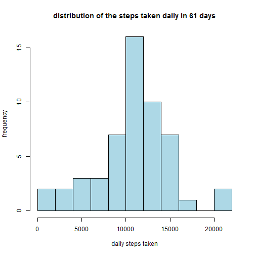
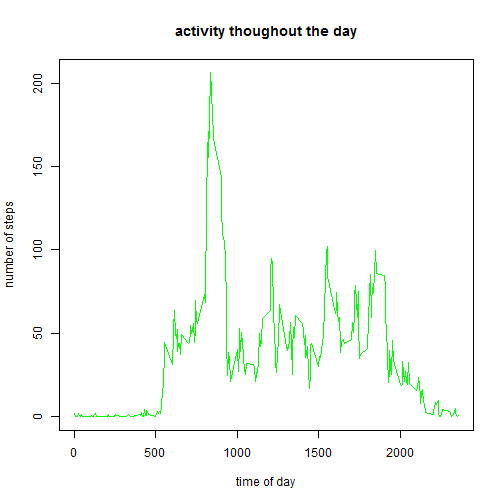
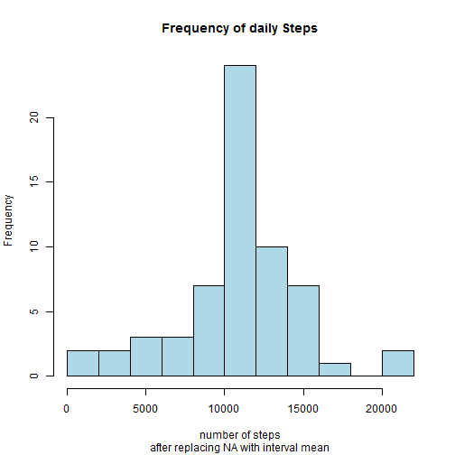

This is the second week assignment for the course "Reproducible Research". I hope that using this document you can reproduce the output I obtained on R. We are going to calculate simple statistics on activity data of a single individual over a period of time. In order to perform this calculations we need to obtain the data. but first let's set the working directory (this could be where you have the data already or where you please since the code will download the data for you if it is not there already):

```r
wd <- setwd(choose.dir()) #select where you want to download the data, or where you have the data already
```
#Loading and preprocessing the data
##downloading and reading the data

now let's download, unzip and read the data. In case you have the data in the working directory you specify previously, the code do not download the data. In case you have already unzipped the data the code jumps directly to read the .csv directly. 


```r
ifelse(
        file.exists("activity.csv"),
                    print("you are ready to roll"),
        ifelse(file.exists("repdata%2Fdata%2Factivity.zip"),
                unzip("repdata%2Fdata%2Factivity.zip"), {
                download.file("https://d396qusza40orc.cloudfront.net/repdata%2Fdata%2Factivity.zip", destfile = "./repdata%2Fdata%2Factivity.zip")
                ;unzip("repdata%2Fdata%2Factivity.zip")}
               )
)
```

```
## [1] "you are ready to roll"
```

```
## [1] "you are ready to roll"
```
now that we have the data unzipped in our working directory we are going to read the dataset. also we pass the column class

```r
act <- read.csv("activity.csv")
```
For the upcoming analysis (or should I say downcoming) it is useful to know a couple of stuff about the data set. First of all the first column is the numer of steps and the second column is the date. The 3th variable is more tricky because even if it is a factor the data is a number so we can be confuse by it. The way i see it is that since it is the recording on 5 minutes intervals this is the time at which the recording was complete, even if the assignment says it is the "identifier". 
#loading libraries
since we are going to use dplyr and lattice package we load it

```r
library(dplyr, quietly = TRUE)
library(lattice)
```

#What is mean total number of steps taken per day?
For this one, first we have to sum the number of steps of each observation grouping by date report a histogram and then obtain the mean of that.
##Calculate the total number of steps taken per day

```r
daily_steps <- aggregate(steps ~ date, data = act, sum) 
```

##Make a histogram of the total number of steps taken each day

```r
hist(daily_steps$steps, breaks= 8 ,ylab = "frequency", xlab = "daily steps taken", main = "distribution of the steps taken daily in 61 days", col = "lightblue" )
```



##Calculate and report the mean and median of the total number of steps taken per day

```r
a <- round(mean(daily_steps$steps, na.rm = TRUE), 1)
b <- median(daily_steps$steps, na.rm = TRUE)
print(a)
```

```
## [1] 10766.2
```

```r
print(b)
```

```
## [1] 10765
```
as we can see the mean is 10766 and the median is 10765, they are really close

#What is the average daily activity pattern?
##Make a time series plot of the 5-minute interval and the average number of steps taken, averaged across all days

```r
interval_mean <- aggregate(steps ~ interval,data = act,  mean, na.rm = TRUE)
plot(interval_mean$interval, interval_mean$steps, type = "l", main = "activity thoughout the day", xlab= "time of day", ylab= "number of steps", col = "green")
```



##Which 5-minute interval, on average across all the days in the dataset, contains the maximum number of steps?

```r
c <- interval_mean[interval_mean$steps == max(interval_mean$steps),1]
```
the interval with the highest mean of steps is 835

#Imputing missing values
so the number of rows with NA is 2304 using the following code (taking in consideration that just variable steps has NA values)

##Calculate and report the total number of missing values in the dataset

```r
sum(is.na(act))
```

```
## [1] 2304
```

##Devise a strategy for filling in all of the missing values in the dataset.
we are going to fill the missing values with the average of the steps for the giving interval

##Create a new dataset that is equal to the original dataset but with the missing data filled in.

```r
na <- act[is.na((act$steps)),] #dataset of all NA
j <- left_join(na, interval_mean, c("interval")) #create a new variable with the mean for each row interval
j <- j[,c(4,2,3)] #reorders the data to match the structure
colnames(j) <- c("steps", "date", "interval")
act_no_na <- act[!is.na(act$steps),] #data set witout NA
act2 <- rbind(act_no_na, j)
```

##Make a histogram of the total number of steps taken each day 

```r
daily_steps2 <- aggregate(steps ~ date, data = act2, sum)
hist(daily_steps2$steps, main = "Frequency of daily Steps", sub = "after replacing NA with interval mean", xlab = "number of steps", breaks = 8, col = "lightblue")
```



##Calculate and report the mean and median total number of steps taken per day.

```r
d <- round(mean  (daily_steps2$steps, na.rm = TRUE), 1)
e <- median(daily_steps2$steps, na.rm = TRUE)
print(d)
```

```
## [1] 10766.2
```

```r
print(e)
```

```
## [1] 10766.19
```

```r
round(sum(act2$steps) - sum(act$steps, na.rm = TRUE),1)
```

```
## [1] 86129.5
```

the mean for the 2 datasets are the same since we are introducing the mean value for each NA value. The daily number of steps increases since we introduce value to observations that previously were NA.  86,129.5 steps were intruduced.
#Are there differences in activity patterns between weekdays and weekends?
##Create a new factor variable whether a given date is a weekday or weekend day.

```r
act2$date <- as.Date(act2$date)
act2$day <- ifelse(weekdays(act2$date) %in% c("Saturday", "Sunday"), "weekend", "weekday")
act2$day <- factor(act2$day)
```
###Make a panel plot containing a time series plot of the 5-minute interval and the average number of steps taken, averaged across all weekday days or weekend days

```r
interval_mean2 <- aggregate(steps ~ interval + day ,data = act2, mean, na.rm = TRUE)
xyplot(steps ~ interval | day, data = interval_mean2, layout = c(1,2), ylab = "Number of steps", xlab = "Interval", type = "l")
```


